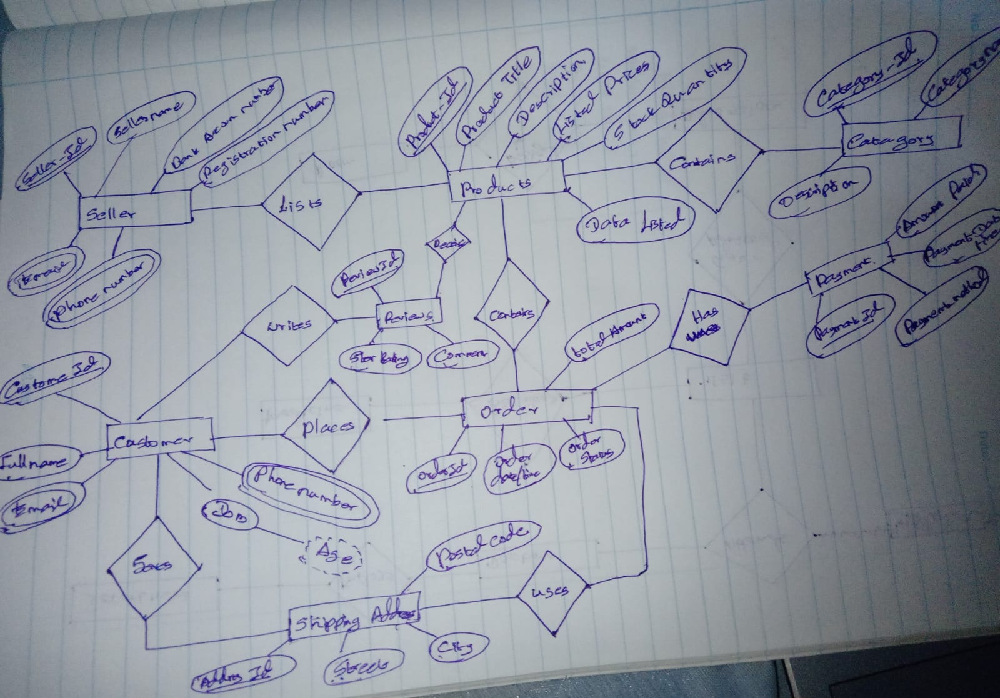

# Question 2 — Online E-Commerce Platform (Retail Industry)

## Scenario

A technology startup is launching an online marketplace where independent sellers can list their products and customers can purchase them. You have been brought in to design the database that will power this platform.

**Sellers** must register before they can list any products. Each seller has a unique seller ID, a store name, a full legal name, a verified email address, a phone number, a bank account number for receiving payments, and a registration date. A seller can list as many products as they want on the platform.

Every **product** listed on the platform belongs to exactly one seller. A product record includes a product ID, a product title, a detailed description, the listed price, the available stock quantity, and the date it was listed. Products are also assigned to a **category** to help customers browse. A category has a category ID, a category name, and a short description. Each product belongs to exactly one category, but a category can contain many products.

**Customers** create accounts to shop on the platform. A customer's profile stores their customer ID, full name, email address, a hashed password, phone number, date of birth, and the date they joined the platform. A customer can save multiple **shipping addresses** to their account — each address has an address ID, a street, a city, a postal code, and a country. A customer may have many saved addresses but selects one specific address per order.

When a customer decides to buy, they place an **order**. An order has an order ID, the date and time it was placed, the shipping address chosen for that order, the overall order status (e.g., Pending, Processing, Shipped, Delivered, Cancelled), and the total amount charged. One customer can place many orders, but each order belongs to one customer.

An order can contain multiple products — for example, a customer might order a phone, a case, and a charger in one order. Each product can also appear in orders from many different customers. This means the relationship between orders and products is many-to-many. For each product within a specific order, the system must record the quantity the customer ordered and the unit price of the product at the exact time of purchase (since prices may change over time).

Every order must go through a **payment** process. Each payment is linked to exactly one order and records the payment ID, the payment method used (e.g., Credit Card, PayPal, Bank Transfer, Cash on Delivery), the transaction reference number provided by the payment gateway, the date and time the payment was processed, the amount paid, and the payment status (Successful, Failed, Refunded).

After receiving their products, customers are encouraged to leave a **review** for each product they have purchased. A review contains a review ID, a star rating between 1 and 5, a written comment, and the date the review was submitted. A customer can write at most one review per product. A product can receive reviews from many customers.

---

## Your Task

Draw a complete **Entity-Relationship (ER) Diagram** for the Online E-Commerce Platform described above.

Your diagram must:

1. Identify and clearly label all **entities** in the system.
1.Seller
2.Product
3.Category
4.Customer
5.Shipping_Address
6.Order
7.Order_Item (Weak / Associative Entity)
8.Payment
9.Review

2. List the **attributes** for each entity — underline or mark the **primary key** attribute.
1.Seller
Seller_ID (PK)
Store_Name
Email
Phone_Number
Bank_Account_Number
Registration_Date

2.Product
Product_ID (PK)
Product_Title
Description
Listed_Price
Stock_Quantity
Date_Listed

3.Category
Category_ID (PK)
Category_Name
Description

4.Customer
Customer_ID (PK)
Full_Name
Email
Hashed_Password
Phone_Number
DOB
Joined_Date

5.Shipping_Address
Address_ID (PK)
Street
City
Postal_Code
Country

6.Order
Order_ID (PK)
Order_Date_Time
Order_Status
Total_Amount

7.Order_Item 
Quantity
Unit_Price_At_Purchase

8.Payment
Payment_ID (PK)
Payment_Method
Transaction_Reference_No
Payment_Date_Time
Amount_Paid
Payment_Status

9.Review
Review_ID (PK)
Star_Rating
Comment
Review_Date

3. Identify all **relationships** between entities and give each relationship a meaningful name.

Seller → Lists → Product
Category → Contains → Product
Customer → Saves → Shipping_Address
Customer → Places → Order
Order → Contains → Product
Order → Has → Payment
Customer → Writes → Review
Product → Receives → Review
Order → Uses → Shipping_Address

4. Specify the correct **cardinality** (1:1, 1:N, or M:N) and **participation constraints** (total or partial) for every relationship.

Relationship	                            Cardinality	                        Participation Constraint
Seller — Lists — Product	                    1 : N	                            Product = Total, Seller = Partial
Category — Contains — Product	                1 : N	                            Product = Total, Category = Partial
Customer — Saves — Shipping_Address	            1 : N	                            Shipping_Address = Total, Customer = Partial
Customer — Places — Order	                    1 : N	                            Order = Total, Customer = Partial
Order — Contains — Product	                    M : N	                            Order = Partial, Product = Partial
Order — Has — Payment	                        1 : 1	                            Payment = Total, Order = Total
Customer — Writes — Review	                    1 : N	                            Review = Total, Customer = Partial
Product — Receives — Review	                    1 : N	                            Review = Total, Product = Partial
Order — Uses — Shipping_Address	                N : 1	                            Order = Total, Shipping_Address = Partial

5. Identify any **weak entities** and their identifying relationships.
Order_Item

Order_Item cannot exist without:
Order
Product

Order ↔ Contains ↔ Product

6. For every **M:N relationship**, identify and include the **relationship attributes** that belong to the association, not to either individual entity.

Order ↔ Contains ↔ Product

M : N

Relationship Attributes:
Quantity
Unit_Price_At_Purchase

---

## Marking Criteria

| Criteria | Marks |
|----------|-------|
| Correct entities identified | 10 |
| Correct attributes with primary keys | 10 |
| Correct relationships & cardinality | 15 |
| Weak entities / relationship attributes | 10 |
| Diagram clarity and notation | 5 |
| **Total** | **50** |
